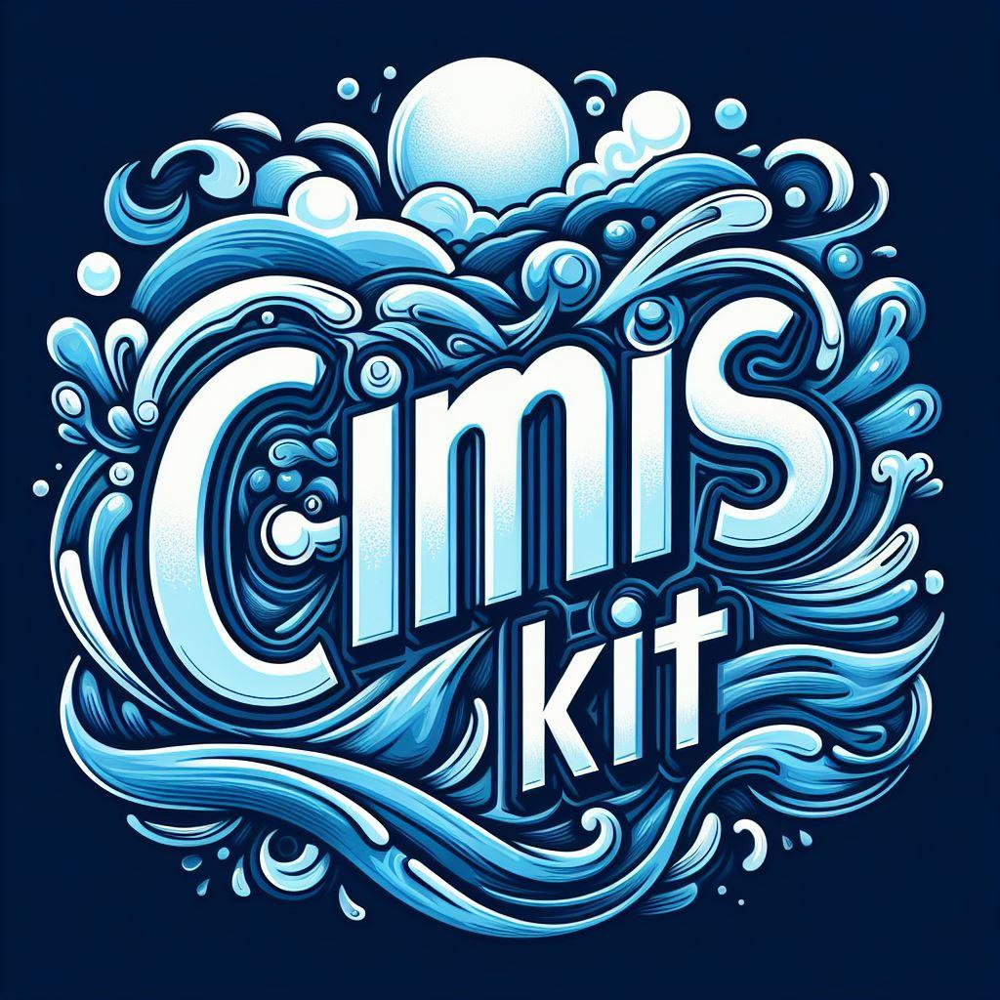

#  CIMISKit
### Created by Dalton Alexandre on 4/3/24.

## Introduction
The California Irrigation Management Information System (CIMIS) is a program unit in the Water Use and Efficiency Branch, Division of Regional Assistance, California Department of Water Resources (DWR) that manages a network of over 145 automated weather stations in California. CIMIS was developed in 1982 by DWR and the University of California, Davis (UC Davis). It was designed to assist irrigators in managing their water resources more efficiently. Efficient use of water resources benefits Californians by saving water, energy, and money.

## Data Collection, Transmission, and Processing
CIMIS weather stations collect weather data on a minute-by-minute basis. Hourly data reflects the previous hour's 60 minutes of readings. Hourly and daily values are calculated and stored in the dataloggers. A computer at the DWR headquarters in Sacramento calls every station starting at midnight Pacific Standard Time (PST) and retrieves data at predetermined time intervals. At the time of this writing, CIMIS data is retrieved from the stations every hour.
When there is a communication problem between the polling server and any given station, the server skips that station and calls the next station in the list. After all other stations have reported, the polling server again polls the station with the communication problem. The interrogation continues into the next day until all of the station data have been transmitted.

CIMIS data processing involves checking the accuracy of the measured weather data for quality, calculating reference evapotranspiration (ETo/ETr) and other intermediate parameters, flagging measured and calculated parameters, and storing the data in the CIMIS database. Evapotranspiration (ET) is a loss of water to the atmosphere by the combined processes of evaporation from soil and plant surfaces and transpiration from plants. Reference evapotranspiration is ET from standardized grass or alfalfa surfaces over which the weather stations are sitting. The standardization of grass or alfalfa surfaces for a weather station is required because ET varies depending on plant (type, density, height) and soil factors and it is difficult, if not impossible, to measure weather parameters under all sets of conditions. Irrigators have to use crop factors, known as crop coefficients (Kc), to convert ET from the standardized reference surfaces into an actual evapotranspiration (ETc) by a specific crop.

## Data Retrieval by Users
CIMIS weather stations are randomly distributed throughout California. It is very important that users select stations that represent the same microclimate as their area of interest. Resources to assist users in selecting representative weather stations include the CIMIS web site, local water districts, farm advisors, consultants, and CIMIS staff.
Calculated parameters (such as ETo, net radiation, and dew point temperature) and measured parameters (such as solar radiation, air temperature, relative humidity, and wind speed) are stored in the CIMIS database for unlimited free access by registered CIMIS data users. Data can be retrieved using the CIMIS web site [here](https://cimis.water.ca.gov/WSNReportCriteria.aspx).

Web Services for CIMIS includes the CIMIS Web API. This platform provides CIMIS data over SOAP and REST protocols free of charge. The RESTful services have been designed with a simplified interface that allows data to be queried by specific weather stations, zip codes, geographic coordinates, and even street addresses. New services allow users to get CIMIS station data as well a comprehensive list of supported zip codes for the Spatial and station systems. Please visit the [CIMIS Web API](http://et.water.ca.gov/Home/Faq) website for more details.

## Trends in CIMIS Data Users

Although CIMIS was initially designed to help agricultural growers develop water budgets for determining when to irrigate and how much water to apply, the user base has expanded over the years. Current CIMIS data users include landscapers, local water agencies, fire fighters, air control board, pest control managers, university researchers, school teachers, students, construction engineers, consultants, hydrologists, government agencies, utilities, lawyers, weather agencies, and many more.
The number of registered CIMIS data users has also been growing steadily over the years. Currently, there are over 40,000 registered CIMIS data users. This number reflects only those registered users that are primary users of the CIMIS data. All users that are registered with CIMIS and have access to the archived CIMIS data are considered primary users. It has been established that thousands more users get CIMIS data from primary users. Examples include local water districts and consultants providing CIMIS data to their clients, newspapers providing ETo data to their subscribers, and websites providing CIMIS data to their customers. Users that get their data from sources other than the CIMIS database are referred to as secondary or tertiary users.

## Registation
Register by filling in the required information on the [page](https://cimis.water.ca.gov/Auth/Register.aspx). Registration is required for statistical purposes only and your information is not shared with any group or entity.
Request a Web API AppKey after registering on our site by scrolling to the bottom of the 'Edit Accounts' page and clicking on the 'GetAppKey' button.

